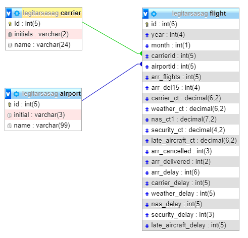

# itmp-repulesi-statisztika-4-1

K�pek, ikonok �tsz�nez�se, �tm�retez�se: Paint 3D programban
egyszer� kezelni
a Windows r�szek�nt telep�t�dik, friss�t�dik
egy alkalmaz�sban meg lehet csin�lni az �tsz�nez�st, �s a m�retez�st
k�nnyen menthet�
Log�k kigy�jt�se: b�rmelyik internet b�ng�sz� gyors, pontos tal�latot ad.
a log�k legt�bb helyen k�l�n k�pk�nt let�lthet�k
Log�k m�retez�se: Paint 3D programmal

#### Backed feladatok

**1.	A kapott csv �llom�ny feldolgoz�sa**

A flight.csv 22 779 sornyi adatot tartalmaz. Minden sorban 22 adat vessz�vel elv�lasztva. Ezt a karaktert szepar�tork�nt haszn�lva fel kellett darabolni a sorokat, hogy egyedi adatokat kapjunk. 

Ezt megnehez�t� t�nyez�k:

-	az rep�l�t�r r�vid�t�se �s v�rosa egy id�z�jelben szerepelt a rep�l�t�r nev�vel.
-	n�h�ny sorban hi�nyz� adatok
-	egy-egy sorban m�g n�h�ny szepar�tor is hi�nyzott

**2.	Adatfeldolgoz�s m�dj�nak kiv�laszt�sa**

Mivel weben megjelen� alkalmaz�sr�l van sz�, legc�lszer�bbnek a MySQL + PHP megold�s t�nt. Ezek seg�ts�g�vel a feladatban k�rt eredm�nyek egyetlen j�l meg�rt SQL paranccsal hat�konyan �s gyorsan megjelenthet�k �gy, hogy az SQL lek�rdez�s eredm�nyt�bl�ja egy PHP m�trixba ker�l. Ennek tartalma alapj�n pedig legener�ljuk a sz�ks�ges HTML k�dot.

**3.	MySQL adatb�zis l�trehoz�sa**

A feladat k�rte t�bb eredm�ny megjelen�t�s�t ezen adatok alapj�n. C�lszer� volt ez�rt adatb�zisba tenni azokat. Az adatb�zisnak viszont 3. norm�lform�ban kell lennie. Ez�rt a redund�ns �rt�keket tartalmaz� oszlopokb�l k�l�n t�bl�k k�sz�ltek. 

**4.	Adatb�ziskapcsolat kialak�t�sa**

A kapcsolat fel�ll�t�sa egy PHP oszt�ly seg�ts�g�vel t�rt�t a PDO oszt�ly kiterjszt�s�vel.
Neve: Database.php, tartalma megtekinthet� a server mapp�ban:

**5.	Feladatmegold�sok**

Megoldand� feladatok:
-	minden l�gitarsas�g felsorol�sa
-	egy kiv�lasztott l�git�rsas�g k�l�nf�le adatainak megjelen�t�se
-	top 3 rept�r fogadott j�ratok sz�ma alapj�n
-	top 3 l�git�rsas�g k�s�s alapj�n

Minden feladatra �s az azokon bel�li r�szeredm�nyek lek�rdez�s�re k�l�n f�ggv�ny k�sz�lt. Ezek egy PHP oszt�lyban ker�ltek kidolgoz�sra. Neve: Query.php, tartalma megtekinthet� a server mapp�ban:

**6.	PHP**

Az id�k�zben elk�sz�lt html oldalak lecser�l�se php oldalakra, ahol a f�ggv�nyh�v�sok megt�rt�ntek, majd a visszaadott eredm�nyek a megtervezett arculatnak megfelel�en dinamikusan megjelentek.
A PHP f�jlok megtekinthet�k a pages mapp�ban

**7.	Kitelep�t�s**

Az elk�sz�lt weboldal nyilv�nos url c�men val� megjelen�t�s�hez ingyenes webt�rhelyre volt sz�ks�g adatb�zis szolg�ltat�ssal. A v�laszt�s a www.000webhost.com oldalra esett.
Regisztr�ci� ut�n PhpMyAdmin �s webes file upload szolg�ltat�st ny�jt korl�tozott m�retben. Ide ker�lt fel az adatb�zis �s weboldalhoz tartoz� �llom�nyok. 

A weboldalt �gy b�rki megtekintheti az al�bbi c�men: http://americanflights.000webhostapp.com/

##Python

###Python-ról röviden
> A Python egy általános célú, nagyon magas szintű programozási nyelv, melyet Guido van Rossum holland programozó kezdett el fejleszteni 1989 végén, majd hozott nyilvánosságra 1991-ben. A nyelv tervezési filozófiája az olvashatóságot és a programozói munka megkönnyítését helyezi előtérbe a futási sebességgel szemben.

> A Python többek között a funkcionális, az objektumorientált, az imperatív és a procedurális programozási paradigmákat támogatja. Dinamikus típusokat és automatikus memóriakezelést használ, ilyen szempontból hasonlít a Scheme, Perl és Ruby nyelvekhez, emellett szigorú típusrendszerrel rendelkezik.

> A Python úgynevezett interpreteres nyelv, ami azt jelenti, hogy nincs különválasztva a forrás- és tárgykód, a megírt program máris futtatható, ha rendelkezünk a Python értelmezővel. A Python értelmezőt számos géptípusra és operációs rendszerre elkészítették, továbbá számtalan kiegészítő könyvtár készült hozzá, így rendkívül széles körben használhatóvá vált.
